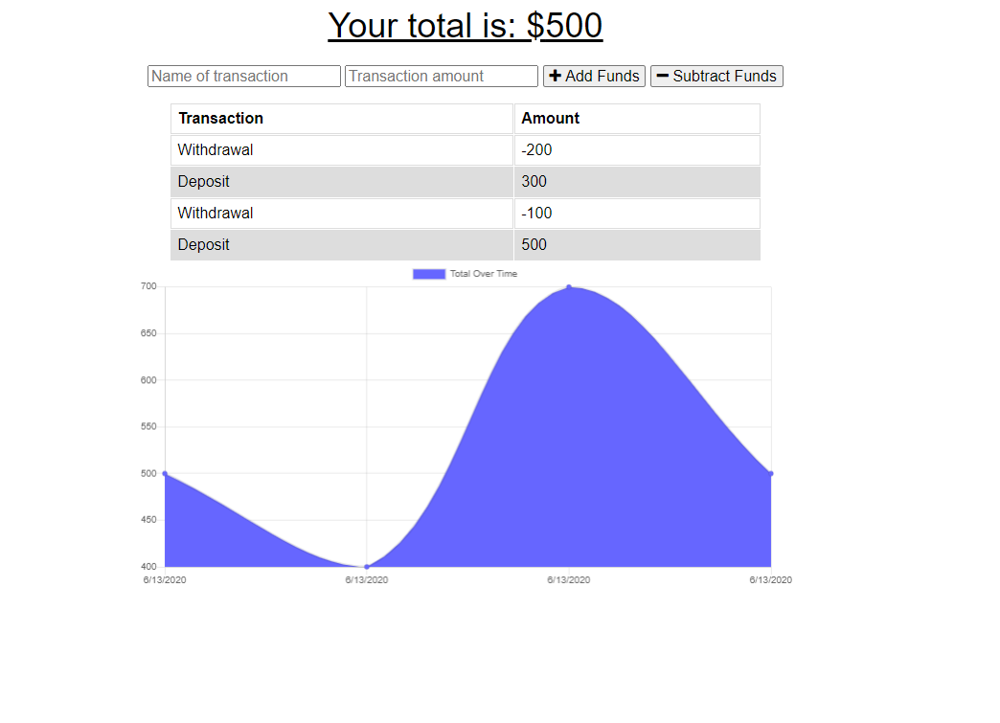
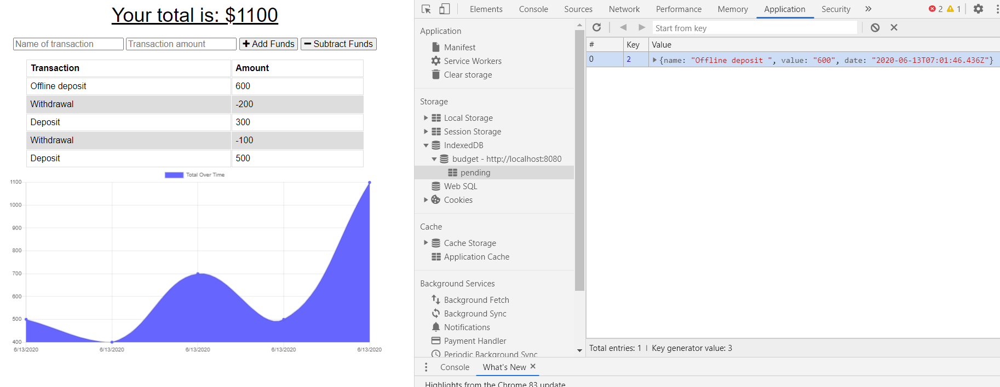

# Budget Tracker

This application can be used by the user to track their budgets by adding or subtracting funds both online and offline. If the user doesn not have access to the internet, they can continue to record their activity which will then be uploaded when they return back online.
Techonologies used for the implementation of this application include: 
* MongoDB/Mongoose
* Express.js
* Node.js
* IndexDB (to manage offline database entries)
* Service worker (to cache files)

## Preview: 

